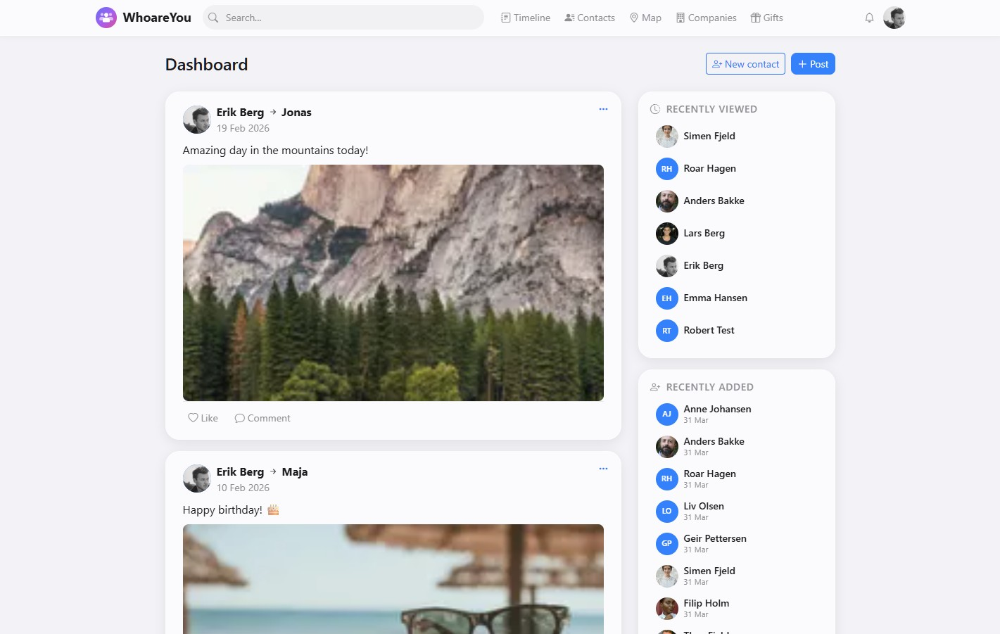

# WhoareYou

**A modern, self-hosted Personal Relationship Manager for the whole family.**

> **Not a social network.** Posts are your private journal about the people in your life — visible only to you and invited household members. Think of it as a personal log of shared moments, not a public feed.

WhoareYou combines the best ideas from [Monica CRM](https://github.com/monicahq/monica), Facebook's timeline, family tree tools, and photo-sharing services like MomentGarden — into one private, self-hosted app for your family.

Keep track of the people in your life: birthdays, addresses, how you met, what you talked about, and how everyone is connected. Share your children's milestones with grandparents through a built-in family portal. Plan gifts, map relationships, and never forget a birthday.

## Why WhoareYou?

- **Your data, your server.** Self-hosted with Docker. No cloud, no tracking, no subscriptions.
- **Built for families.** Multi-user accounts with shared and private data. Add household members — even children who don't need login access.
- **Family sharing.** Built-in portal lets grandparents, aunts, and extended family view and interact with your children's timelines — like MomentGarden, but on your own server.
- **See connections.** Interactive family tree with pan/zoom, relationship mapping, and auto-suggested connections.
- **One timeline.** Photos, videos, documents, milestones — everything in a single searchable timeline with @-mentions, comments, and likes.

## Features

| Feature | Description |
|---------|-------------|
| **Contacts** | Full contact management with photos, custom fields, social media links, favorites, and soft delete |
| **Timeline** | Universal post system with photos, videos, documents, @-mentions, comments, and reactions |
| **Family portal** | Share timelines with extended family via guest accounts or shareable links — no app needed |
| **Relationships** | 21 relationship types with bidirectional linking, family tree visualization, and auto-suggestions |
| **Addresses & Maps** | Geocoded addresses with interactive maps, address history, and household views |
| **Gifts** | Gift planning with events, product catalog (URL scraping), wishlists, status tracking, and smart visibility |
| **Family tree** | SVG visualization with pan/zoom, view modes (lineage/ancestors/descendants), and category filters |
| **Photos & media** | Profile photos with crop, post images/videos/documents, lightbox viewer, drag-and-drop |
| **Multi-tenant** | Host multiple families on one instance with complete data isolation |
| **Security** | 2FA (TOTP), passkeys (WebAuthn), IP/country whitelisting, session management |
| **i18n** | English and Norwegian out of the box, easy to add more |

### Also Included

- **Labels & groups** — organize contacts with categories, split-view transfer tool
- **Companies** — company directory with employees and job titles
- **Life events** — 10 types with icons, anniversary reminders, timeline integration
- **Reminders & notifications** — birthday auto-alerts, custom reminders, in-app notification bell
- **Global search** — search contacts, posts, companies from anywhere
- **MomentGarden import** — migrate photos, videos, and captions from MomentGarden exports
- **Email notifications** — configurable SMTP, login alerts, welcome emails

## Tech Stack

| Layer | Technology |
|-------|-----------|
| Frontend | Vanilla ES6+ JavaScript, Bootstrap 5, Leaflet |
| Backend | Node.js, Express, Knex.js |
| Database | MySQL 8+ |
| Images | sharp (WebP, thumbnails, EXIF stripping) |
| Auth | bcrypt + JWT + TOTP 2FA + Passkeys (WebAuthn) |
| Geocoding | Nominatim (OpenStreetMap) — no API key needed |
| Hosting | Docker (Alpine + Nginx reverse proxy) |

No build step. No framework lock-in. No external service dependencies.

## Getting Started

> Docker images are not yet published to a registry. Clone the repo and build locally for now.

<!-- TODO: Add setup instructions when Docker image is published -->

## Security

Security is taken seriously. See [SECURITY.md](SECURITY.md) for the full assessment, including:

- 4 rounds of security audits (AI-assisted code review)
- bcrypt, short-lived JWTs, 2FA, passkeys
- IP and country whitelisting
- Tenant isolation verified across all routes
- Recommendations for self-hosters

## AI-Assisted Development

This project is built with [Claude Code](https://claude.ai/claude-code) (Anthropic's AI coding assistant). It is functional, feature-rich, and in daily use — but has not undergone traditional peer code review.

**This software is provided as-is.** You are welcome to use it, fork it, and modify it. Host at your own risk.

## Screenshots

<!-- TODO: Add screenshots -->

## Documentation

Developer documentation is in the [docs/](docs/) folder:

- [Architecture](docs/architecture.md) — tech stack, project structure
- [Database](docs/database.md) — schema, tables, migrations
- [API Reference](docs/api.md) — all REST endpoints
- [Frontend Guide](docs/frontend.md) — components, pages, patterns
- [Design Guidelines](docs/design-guidelines.md) — UI/UX rules
- [Security](docs/security.md) — auth flow, IP security, audits
- [Integrations](docs/integrations.md) — MomentGarden, SMTP, geolocation
- [Family Portal](docs/portal.md) — portal architecture

## License

<!-- TODO: Choose and add license -->

## Acknowledgments

- [Monica](https://github.com/monicahq/monica) — the original inspiration
- [Claude Code](https://claude.ai/claude-code) — AI-assisted development
- [OpenStreetMap](https://www.openstreetmap.org/) & [Nominatim](https://nominatim.org/) — maps and geocoding
- [Leaflet](https://leafletjs.com/) — interactive maps
- [Bootstrap](https://getbootstrap.com/) — UI framework
- [sharp](https://sharp.pixelplumbing.com/) — image processing
